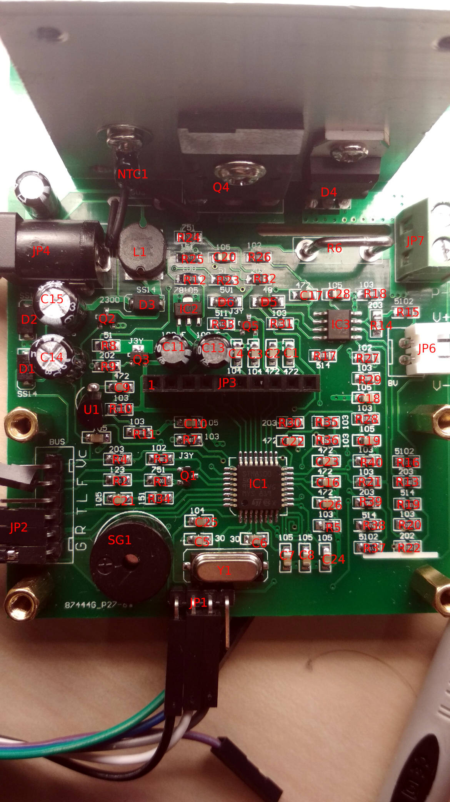

# ZPB30A1 Firmware

This repository is there to build an open-source firmware for the 60W ZPB30A1 electronic load (often sold as "60W electronic load" without any article number).

## Original Firmware
The original firmware has read out protection enabled. Therefore you can't go
back to this version once you flash a different one. But this firmware aims to
be much better in every possible way. If you need a feature either add it on
your own and submit a pull request or open an issue and wait till I add it.

## Compiler

This software requires [Small Device C Compiler (SDCC)](http://sdcc.sourceforge.net/)
version 3.8 or higher (3.7 sometimes crashes during compilation).

## Chip
The datasheet of the STM8S005 claims a write endurance of only 100 flash cycles
but this is only for marketing purposes as it [contains the same die](https://hackaday.io/project/16097-eforth-for-cheap-stm8s-gadgets/log/76731-stm8l001j3-a-new-sop8-chip-and-the-limits-of-stm8flash)
as the STM8S105 which is rated for 10000 cycles. So you don't have to worry
about bricking you device by flashing it to often. Mine has far more than 100
cycles and still works. You can easily verify the two chips are the same as you
can write the whole 1kB of EEPROM the STM8S105 has instead of only 128 bytes
as claimed by the STM8S005 datasheet.

## Flashing
As the original firmware has the bootloader disabled you need a STLink programmer
in order to unlock it. Connect it like this:

If you are programming the chip for the first time you have to unlock it.
'''WARNING:''' This irreversibly deletes the original firmware.

    make unlock

Then you write the new firmware with

    make flash

and if you are flashing for the first time you should also clear the EEPROM:

    make clear_eeprom

## Menu
Contrary to the original firmware which requires rebooting to change modes this
firmware is completely configurable by an integrated menu system. Push the
encoder button to select an item. The "Run" button acts as a back button in most
situations. Only in the top level menu it is used to enable the electronic load.
The currently selected option blinks. When setting a numeric value the two
LEDs between the displays show the selected digit.
Values shown with a decimal point are in the unit shown by the LEDs or on the
display. If no decimal point is shown it means the display shows 1/1000 of the
selected unit.
### Examples
* 10.0 + V LED: 10.0V
* 1.23 + A LED: 1.23A
* 900 + V LED: 900mV = 0.9V

### Menu structure
* MODE
    * CC: Constant current (default)
    * CV: Constant voltage
    * CR: Constant resistance
    * CW: Constant power
* VAL: Sets the target value for the currently selected mode. The upper display
        shows the unit.
* ILIM: Current limit (not active in CC mode)
* ...: More settings
    * BEEP: Beeper on/off
    * CUTO: Undervoltage cutoff
        * ENAB: Enable/disable
        * CVAL: Cutoff value in Volt
    * MAXP: Maximum power action
        * OFF: Turn off load when the required power would be greater than the hardware limit
        * LIM: Reduce load current to stay within hardware limits

### Error codes
* OVP: Over voltage protection. Voltage connected to P+/P- is too high. (Note: This function can only warn about voltages which are slightly to high. Large voltages will destroy the electronic load!)
* OVLD: The load can't maintain the set value. Usually this means that the source can't deliver enough current or the source's voltage is to low.
* PWR: Power required to maintain the setpoint is greater than hardware's power limit.
* TEMP: Temperature is to high. Check if the fan is working and the thermistor is connected.
* SUP: 12V input voltage is too low. Connect better power supply.
* INT: Internal error. Should not happen. Check the source code where this error is set and try to fix it.

## Specifications

| Param           | Range    | Value
| --------------- | -------- | ---
| Voltage Input   | 0-30 V   | ± 0.3% ± 20 mV (oversampling the 10 bit ADC to get 12 fake bit)
| Current control | 0-10 A   | ± 0.1% ± 1 mA
| Temperature     | 30-90°C  | ± 1.5 °C

## History
This firmware started as a project to extend the firmware written by
(soundstorm)[https://github.com/ArduinoHannover/ZPB30A1_Firmware] but it turned
out as an almost complete rewrite which keeps the user interface idea.

## Schematic
Schematic can be found in hardware/schematic.pdf.

### Schematic corrections:
* R5 = 10k
* R27 = 1k
* D6 = reversed polarity

### Component locations

